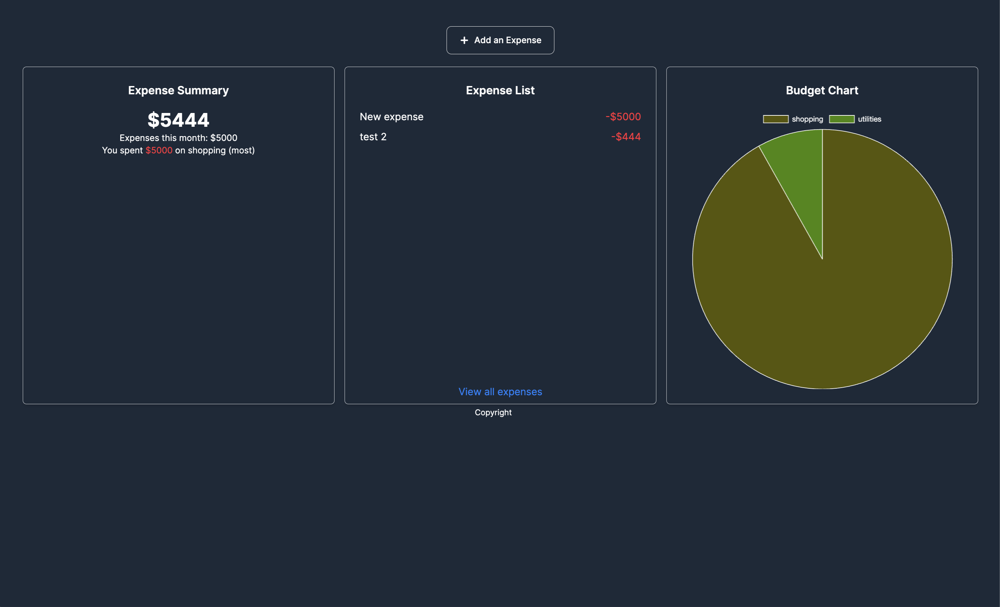

<h1 align="center">Welcome to Spendwise👋</h1>
<p>
  
  <a href="#" target="_blank">
    
  </a>
  <a href="https://twitter.com/simply_rammy" target="_blank">
    
  </a>
</p>

> Spendwise is a simple expense tracker that allows users to keep track of their expenses and view their spending habits over time.
> This project is a lightweight web application that utilizes HTML, CSS, and Go to create a dynamic user experience without the need for complex frameworks. Additionally, it incorporates htmx, a library that allows for seamless and efficient server-side rendering of HTML content.



## Install

```sh
npm install -g tailwindcss
```

## Usage

> To get this project running pefectly on your local, ensure you follow the instructions below.

1. Create a .env file in the root directory.
2. In the .env file ensure you have the following setup.

```
GOOGLE_CLIENT_ID=
GOOGLE_CLIENT_SECRET=
STATE_STRING_GL=random-random
PORT=
DB_USER=
DB_PASSWORD=
DB_PORT=
DB_HOST=
DB_NAME=
```

- To get your google details, you a need to create a project on the google developer console and get your client id and client secret. https://medium.com/@bnprashanth256/oauth2-with-google-account-gmail-in-go-golang-1372c237d25e

3. Run the go command below

```sh
go run .
```

To run the tailwindcss(If you add new classes), you need to run the command below.

```sh
tailwindcss -i ./static/css/input.css -o ./static/css/output.css --watch
```

- You could also use the [https://github.com/cosmtrek/air](Air) to run the project.

4. Visit http://localhost:port to login the user you created.

## Contribution

If you find an issue running this project please send in a PR.

## Author

👤 **Onasanya Tunde**

- Website: https://onasanyatunde.dev
- Twitter: [@simply_rammy](https://twitter.com/simply_rammy)
- Github: [@rammyblog](https://github.com/rammyblog)
- LinkedIn: [@onasanya-tunde](https://linkedin.com/in/onasanya-tunde)

## Show your support

Give a ⭐️ if this project helped you!

// TODO

- Clean up the UI
- Error form
- Pagination

---
